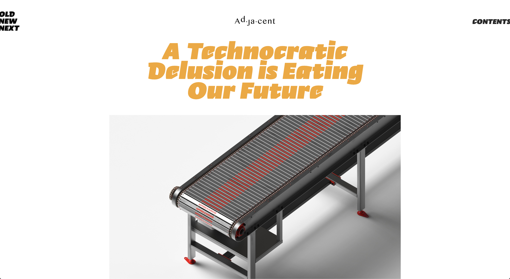

# Design Guidelines

We're having fun here, and we don't need to care about universal or industrial rules; but certain practices for good user experience and accessibility are still required. The design guidelines provided by [Material Design](https://material.io/) system is very helpful. We can take advantage of the principles of hierarchy and naming in terms of colors, fonts and layouts. Note that it's not the styles we're looking for in the guidelines, but the principles and design patterns.

---

## Website main sections

Adjacent website typically consists of three main sections that require designers attention: landing page, article page and menu. Always keep article page and menu in mind as designing landing page, making sure everything is going to be consistent.

---

## Design systems

For consistency of the website and efficient communication between dev team members, sets of elements in following aspects are suggested to be considered during the design process.

### Typography

It's suggested to use up to **two types of fonts** in Adjacent website.

- **Font family**
	- Main font - Major font used across the website.
	- Sub font - Minor font choice for long paragraph or secondary information.

- **Font weight**
	- If required, each font family should have according variations of font weight.

- **Type scale**
	- It's suggested to organize a system of font size usage, following the naming and spec [Material Design](https://material.io/design/typography/the-type-system.html#) provides.

- **Type color**
	- Following the website [color system](https://material.io/design/color/the-color-system.html#color-theme-creation), it's also suggested to think of colors of fonts on other colors.
	- Making sure the contrast between font color and background color is accessible.

	

### Color

Though [Material Design](https://material.io/design/color/the-color-system.html#color-theme-creation) provides a comprehensive setting of color theme, we don't need to follow every details but at least following settings:

1. Primary color
2. Secondary color
3. Background color

### Layout

Constraint of grid system is unnecessary here, but the **margins on two sides** of the website is required. These two vertical bars is the negative space of the **safe and comfortable reading zone** of the website. Very important.

---

## For front-end development
### Responsive design
### Deliverables (UI files) for developers